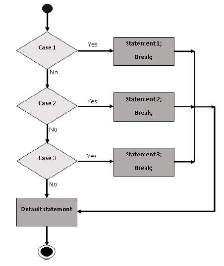

# Lệnh switch…case trong JavaScript

## 1. Khi nào nên dùng switch…case?

Khi bạn có nhiều nhánh lựa chọn dựa vào cùng một biến hoặc cùng một biểu thức, việc sử dụng nhiều lệnh `if…else if…else` sẽ trở nên dài và khó quản lý.  
Từ JavaScript 1.2 trở đi, lệnh `switch` được giới thiệu để xử lý những trường hợp như vậy 


---

## 2. Cú pháp cơ bản

```js
switch (expression) {
  case condition1:
    // các lệnh thực thi nếu expression == condition1
    break;

  case condition2:
    // các lệnh nếu expression == condition2
    break;

  // … bạn có thể có nhiều case…

  default:
    // các lệnh nếu không có case nào trùng với expression
}
```
Giải thích:

 - expression là biểu thức được đánh giá.

 - Bộ thông dịch sẽ so sánh giá trị expression với từng case condition.

 - Khi tìm được case phù hợp, khối lệnh từ case đó sẽ thực thi cho đến khi gặp break hoặc hết switch.

 - Nếu không tìm được case phù hợp, khối default sẽ được thực hiện (nếu có). 


 - Nếu bỏ break, thì sẽ xảy ra hiện tượng “fall-through” — nghĩa là tiếp tục thực thi các case tiếp theo. 


## 3. Ví dụ minh họa
```html
<html>
  <body>
    <script type="text/javascript">
      var grade = 'A';
      document.write("Entering switch block<br />");
      switch (grade) {
         case 'A':
           document.write("Good job<br />");
           break;
         case 'B':
           document.write("Pretty good<br />");
           break;
         case 'C':
           document.write("Passed<br />");
           break;
         case 'D':
           document.write("Not so good<br />");
           break;
         case 'F':
           document.write("Failed<br />");
           break;
         default:
           document.write("Unknown grade<br />");
      }
      document.write("Exiting switch block");
    </script>
    <p>Thử thay đổi giá trị biến và xem kết quả...</p>
  </body>
</html>
```

Kết quả khi grade = 'A':
```typescript
Entering switch block
Good job
Exiting switch block
``` 
---

## 4. Fall-through (Khi không dùng break)

Nếu bạn bỏ qua việc sử dụng `break`, thì khi tìm được case phù hợp sẽ **tiếp tục** thực thi các case phía sau mà không kiểm tra tiếp điều kiện. Ví dụ:

```html
<script type="text/javascript">
   var grade = 'A';
   document.write("Entering switch block<br />");
   switch (grade) {
      case 'A':
        document.write("Good job<br />");
      case 'B':
        document.write("Pretty good<br />");
      case 'C':
        document.write("Passed<br />");
      default:
        document.write("Unknown grade<br />");
   }
   document.write("Exiting switch block");
</script>
```

Trường hợp này sẽ in nhiều dòng, kể cả các thông báo ở case 'A', case 'B', case 'C', rồi tới default. 

## 5. Những lưu ý quan trọng

switch so sánh giá trị không bắt buộc kiểu — bạn cần chú ý kiểu dữ liệu vì nếu kiểu không trùng thì sẽ không được match. (trong nhiều trường hợp là so sánh ===)

Nếu muốn nhiều case xử lý giống nhau, bạn có thể ghép nhiều case vào cùng một khối mà không đặt break giữa chúng.

Việc sử dụng switch…case làm cho code dễ đọc hơn khi có nhiều nhánh lựa chọn từ cùng một giá trị.