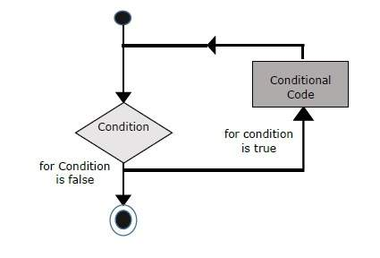

# Vòng lặp for trong JavaScript

## 1. Khi nào nên dùng vòng lặp for?

Khi bạn biết trước **số lần lặp** hoặc có thể xác định một giá trị khởi tạo, điều kiện và bước tăng/giảm rõ ràng, thì sử dụng vòng lặp `for` là lựa chọn hiệu quả.  

## 2. Cú pháp cơ bản

```js
for (khởiTạo; điềuKiện; cậpNhật) {
  // khối lệnh sẽ thực hiện mỗi lần lặp
}
```
Trong đó:

 - khởiTạo — khởi tạo biến lặp (ví dụ let i = 0).

 - điềuKiện — biểu thức kiểm tra trước mỗi lần lặp, nếu true thì tiếp tục, nếu false thì dừng.

 - cậpNhật — cập nhật biến lặp sau mỗi lần thực thi khối lệnh (ví dụ i++).

Ví dụ:

```js
for (let i = 0; i < 5; i++) {
  console.log("Lần lặp thứ: " + i);
}
```
Kết quả:

```less
Lần lặp thứ: 0
Lần lặp thứ: 1
Lần lặp thứ: 2
Lần lặp thứ: 3
Lần lặp thứ: 4
```
## 3. Ví dụ minh họa
```html
<html>
  <body>
    <script type="text/javascript">
      document.write("Start for loop<br />");
      for (let i = 0; i < 3; i++) {
        document.write("i = " + i + "<br />");
      }
      document.write("End for loop");
    </script>
    <p>Thay đổi giá trị biến và điều kiện rồi thử lại …</p>
  </body>
</html>
```
Khi chạy, sẽ in:

```pgsql
Start for loop
i = 0
i = 1
i = 2
End for loop
```
## 4. Một số lưu ý khi dùng for
Biến lặp nên được khai báo với let (hoặc const nếu thích hợp) để tránh bị truy cập từ bên ngoài vòng lặp.

Hãy chắc rằng điều kiện sẽ đến trạng thái false sau một số lần lặp, để tránh vòng lặp vô hạn.

Cập nhật (tăng/giảm) biến lặp phải được thực hiện đúng trong phần cậpNhật hoặc trong thân lặp.

Có thể lồng vòng lặp for bên trong nhau (nested for) để xử lý ma trận, nhiều chiều, hoặc danh sách phức tạp.

Ví dụ vòng lặp lồng nhau:

```js
for (let i = 0; i < 3; i++) {
  for (let j = 0; j < 2; j++) {
    console.log(`i = ${i}, j = ${j}`);
  }
}
```