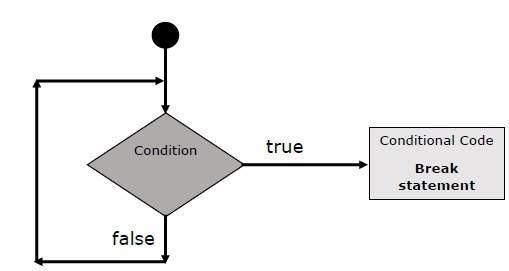

# Điều khiển vòng lặp với `break` & `continue` trong JavaScript

## 1. Giới thiệu  
Khi làm việc với vòng lặp trong JavaScript, bạn đôi khi cần:
- **Thoát khỏi vòng lặp ngay lập tức** mà không tiếp tục các lần lặp còn lại.  
- **Bỏ qua** phần thân hiện tại của vòng lặp và “nhảy” tới lần lặp tiếp theo.  

Để xử lý những tình huống này, JavaScript cung cấp hai lệnh: `break` và `continue`. 

---

## 2. Lệnh `break`  
Lệnh `break` được sử dụng để **thoát khỏi** vòng lặp ngay lập tức — khi gặp `break`, chương trình sẽ **ngừng lặp** và nhảy ra khỏi vòng. 

### Ví dụ với `while`:  
```html
<script type="text/javascript">
   var x = 1;
   document.write("Entering the loop<br/>");

   while (x < 20) {
     if (x == 5) {
       break; // thoát vòng lặp hoàn toàn
     }
     x = x + 1;
     document.write(x + "<br/>");
   }

   document.write("Exiting the loop!<br/>");
</script>
```
Kết quả:

```typescript
Entering the loop  
2  
3  
4  
5  
Exiting the loop!
Set the variable to different value and then try...
```
---

## 3. Lệnh `continue`  
Lệnh `continue` cho phép bạn **bỏ qua phần còn lại** của thân vòng lặp hiện tại và **tiếp tục ngay lần lặp kế tiếp** nếu điều kiện vòng lặp vẫn đúng. 

### Ví dụ với `while`:  
```html
<script type="text/javascript">
   var x = 1;
   document.write("Entering the loop<br/>");

   while (x < 10) {
     x = x + 1;

     if (x == 5) {
       continue; // bỏ qua phần thân còn lại lần này
     }
     document.write(x + "<br/>");
   }

   document.write("Exiting the loop!<br/>");
</script>
```
Kết quả:

```yaml
Entering the loop  
2  
3  
4  
6  
7  
8  
9  
10  
Exiting the loop!
```
---

## 4. Sử dụng label với `break` và `continue`  
Từ JavaScript 1.2 trở đi, bạn có thể sử dụng **nhãn (label)** để điều khiển luồng lặp một cách phức tạp hơn — như thoát khỏi nhiều vòng lặp lồng nhau hoặc tiếp tục vòng ngoài từ bên trong vòng trong. 
> *Lưu ý:* Không được có dòng ngắt giữa `break`/`continue` và tên nhãn của chúng; và việc dùng nhãn nên được cân nhắc vì đôi khi làm code khó đọc.

---

## 5. Những lưu ý quan trọng  
- Khi dùng `break` hoặc `continue`, hãy chắc rằng bạn hiểu rõ **vòng lặp nào** đang bị ảnh hưởng (cần đặc biệt khi có nhiều vòng lặp lồng nhau).  
- `continue` chỉ bỏ qua thân vòng lặp hiện tại, không thoát khỏi toàn bộ vòng lặp như `break`.  
- Việc sử dụng nhãn (label) đem lại quyền năng lớn nhưng cũng có thể làm code trở nên **khó theo dõi và bảo trì** — nên dùng khi thực sự cần thiết.  
- Tránh tình huống lặp vô hạn (infinite loop) vì dùng `continue` mà không thay đổi biến điều kiện, hoặc dùng `break` không đúng chỗ có thể dẫn tới logic sai.

